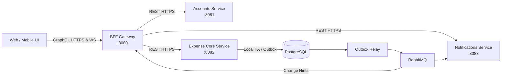

# Pennywise

[](LICENSE)
[](https://kotlinlang.org)
[](https://spring.io/projects/spring-boot)
[](https://adoptium.net)

A permanently free, privacy-centric expense-sharing platform for households, couples, roommates, and travel groups. Pennywise is built as a modular Kotlin/Spring Boot ecosystem with REST domain services, an asynchronous event mesh, a GraphQL BFF, and contract-driven API guarantees.

---

## Table of Contents

- [Overview](#overview)
- [Architecture & Services](#architecture--services)
- [Tech Stack](#tech-stack)
- [Getting Started](#getting-started)
  - [Prerequisites](#prerequisites)
  - [Clone & Environment Doctor](#clone--environment-doctor)
  - [Option A: Running with Docker (Recommended)](#option-a-running-with-docker-recommended)
  - [Option B: Native Development (IDE / Gradle)](#option-b-native-development-ide--gradle)
- [Services & Port Mapping](#services--port-mapping)
- [API & Schema Documentation](#api--schema-documentation)
- [Quality & Verification](#quality--verification)
- [Production Readiness](#production-readiness)
- [Project Structure](#project-structure)
- [Contributing](#contributing)
- [License](#license)

---

## Overview

Pennywise provides a modern alternative to proprietary expense splitters with:
- **Fair Financial Allocations**: Equal splits, exact minor amounts, and percentage allocations (with basis-point rounding guarantees).
- **Passwordless Native Authentication**: The Accounts passwordless slice includes email magic-link/code contracts, a decoupled token-minting SPI (`IdentityProviderPort`), refresh-token family policy, and provider-neutral delivery boundaries. AUTH-03 through AUTH-07 are implemented and verified with live OIDC, broker/Mailpit, REST, GraphQL, WebSocket, Bruno, and CI evidence.

Pennywise is structured into four focused applications and technical libraries:



| Application | Port | Description & Responsibilities |
|---|:---:|---|
| **[Accounts](app/accounts)** | `8081` | Identity linkage, user profiles, preferences, and data privacy/export requests. |
| **[Expense Core](app/expense-core)** | `8082` | Groups, memberships, invitations, expense allocation algorithms, balance settlements, sync changelog, and transactional outbox. |
| **[Notifications](app/notifications)** | `8083` | User inboxes, notification delivery, delivery channel preferences, and email dispatch. |
| **[GraphQL BFF](app/bff)** | `8080` | Client-facing backend-for-frontend combining upstream REST services into a unified GraphQL API and real-time WebSocket subscriptions. |

---

## Tech Stack

- **Language & Runtime**: [Kotlin 2.4.20](https://kotlinlang.org/) with JVM 25.
- **Framework**: [Spring Boot 4.1.1](https://spring.io/projects/spring-boot) (Spring Data JPA, Spring Web / WebFlux, Spring GraphQL).
- **Build Tool**: [Gradle Kotlin DSL](https://gradle.org/) with centralized version catalog (`gradle/libs.versions.toml`).
- **Database**: [PostgreSQL 17](https://www.postgresql.org/) with [Flyway](https://flywaydb.org/) schema migrations and Hibernate validation.
- **Messaging & Events**: [RabbitMQ 4.3](https://www.rabbitmq.com/) with Transactional Outbox pattern.
- **Local Mail Testing**: [Mailpit](https://github.com/axllent/mailpit) for capturing outbound SMTP traffic.
- **Testing & Quality**: JUnit 5, MockMvc, WebTestClient, JaCoCo test coverage, and Spotless linting.

---

## Getting Started

### Prerequisites

Ensure you have the following installed on your workstation:
- **Java 25** (for example, via [SDKMAN!](https://sdkman.io/): `sdk install java 25-open`)
- **Docker & Docker Compose v2** (e.g. Docker Desktop or OrbStack)
- **Python 3.11+** (for contract validation)
- **Make** (standard on macOS and Linux)

### Clone & Environment Doctor

1. Clone the repository:
   ```sh
   git clone https://github.com/ohbus/pennywise.git
   cd pennywise
   ```

2. Run the environment verification check:
   ```sh
   make doctor
   ```

### Option A: Running with Docker (Recommended)

To start the complete environment (Postgres, RabbitMQ, Mailpit, and all 4 microservices):

```sh
# Start all containers in the background
make full-up

# Check container status
make full-status

# Follow logs across all services
make full-logs
```

To shut down the entire container stack:
```sh
make full-down
```

### Option B: Native Development (IDE / Gradle)

If you prefer running and debugging microservices directly inside IntelliJ IDEA or via Gradle:

1. **Start backing dependencies only (Postgres, RabbitMQ, Mailpit)**:
   ```sh
   make deps-up
   ```

2. **Run an application natively**:
   - **Via Gradle CLI**:
     ```sh
     ./gradlew :app:expense-core:bootRun
     ```
   - **Via IntelliJ IDEA**:
     Checked-in run configurations are available under `.idea/runConfigurations/`:
     - `Pennywise Accounts`
     - `Pennywise Expense Core`
     - `Pennywise Notifications`
     - `Pennywise BFF`

3. **Stop backing dependencies**:
   ```sh
   make deps-down
   ```

---

## Services & Port Mapping

When the stack is running, services are accessible at:

| Component | Host URL | Description / UI |
|---|---|---|
| **GraphQL BFF** | `http://localhost:8080/graphql` | GraphQL HTTP endpoint and WebSocket subscriptions |
| **Accounts API** | `http://localhost:8081` | REST endpoints under `/accounts/v1/` |
| **Expense Core API** | `http://localhost:8082` | REST endpoints under `/expense-core/v1/` |
| **Notifications API** | `http://localhost:8083` | REST endpoints under `/notifications/v1/` |
| **Mailpit Web UI** | `http://localhost:8025` | Inspect outbound confirmation and notification emails |
| **RabbitMQ Management** | `http://localhost:15672` | Credentials: `pennywise` / `pennywise-local-only` |
| **PostgreSQL Database** | `localhost:5432` | Credentials: `pennywise` / `pennywise-local-only` |

---

## API & Schema Documentation

Pennywise enforces a contract-first design. All schema definitions reside under [`contracts/`](contracts/):

- **REST Contracts**:
  - Accounts OpenAPI: [`contracts/rest/accounts.openapi.json`](contracts/rest/accounts.openapi.json)
  - Expense Core OpenAPI: [`contracts/rest/expense-core.openapi.json`](contracts/rest/expense-core.openapi.json)
  - Notifications OpenAPI: [`contracts/rest/notifications.openapi.json`](contracts/rest/notifications.openapi.json)
- **GraphQL Schema**: [`contracts/graphql/schema.graphqls`](contracts/graphql/schema.graphqls)
- **Event Mesh Envelopes**: [`contracts/events/envelope.schema.json`](contracts/events/envelope.schema.json)
- **RFC 9457 Problem Details**: [`contracts/errors/problem.schema.json`](contracts/errors/problem.schema.json)
- **Central Constants**: All endpoints and headers are centralized in `com.subhrodip.pennywise.ids.ApiEndpoints`.

---

## Quality & Verification

Pennywise maintains rigorous quality gates. Run any of the following targets:

```sh
# Run fast unit tests
make test-unit

# Run full test suite with JaCoCo coverage reports
make coverage

# Validate contract schemas and task registry
make contracts

# Run Spotless formatting check and linters
make lint

# Run full CI validation suite (contracts, tests, coverage, packaging)
make check

# Run live multi-service acceptance test against running stack
make acceptance-live
```

---

## Project Structure

```text
pennywise/
├── app/                        # Deployable applications
│   ├── accounts/               # User identity, profile & privacy service
│   ├── bff/                    # GraphQL BFF gateway & WebFlux adapters
│   ├── expense-core/           # Financial ledger, groups & allocation engine
│   ├── notifications/          # Notification inbox & email delivery service
│   └── web/                    # Reserved future UI workspace
├── contracts/                  # Authoritative API, GraphQL & event schemas
│   ├── errors/                 # RFC 9457 Problem Details schema
│   ├── events/                 # RabbitMQ event envelope schemas
│   ├── graphql/                # GraphQL schema declarations
│   └── rest/                   # OpenAPI 3.1 specifications
├── docs/                       # Comprehensive documentation
│   ├── architecture/           # Architecture decisions & boundaries
│   ├── operations/             # Deployment, quickstart & compose topology
│   ├── product/                # MVP requirements & scope specifications
│   ├── quality/                # Programming principles & coding standards
│   └── tasks/                  # Task registry, board & progress ledger
├── infra/                      # Infrastructure as Code & Compose topologies
│   ├── deploy/                 # Production Compose configuration
│   └── local/                  # Local dev Compose topologies
├── libs/                       # Shared technical libraries
│   ├── db/                     # Common JPA / Flyway configurations
│   ├── errors/                 # Global error handler & ProblemDetail support
│   ├── ids/                    # Centralized ApiEndpoints & identifier helpers
│   ├── observability/          # Tracing & metrics
│   ├── security/               # Common security adapters
│   └── test-support/           # Shared testing utilities
├── tools/                      # Validation scripts & CI tooling
├── CONTRIBUTING.md             # Developer workflow & contribution guide
├── Makefile                    # One-command developer CLI
└── README.md                   # Project overview and entry point
```

---

## Contributing

We welcome contributions! Please read our [**Contributing Guide (CONTRIBUTING.md)**](CONTRIBUTING.md) for detailed instructions on:
- Setting up your local development environment
- Understanding our documentation-first, task-tracked workflow
- Code style, SOLID file separation, and KDoc standards
- Running tests, linter, and contract validation
- Submitting pull requests

---

## License

Pennywise is open-source software licensed under the [MIT License](LICENSE).
