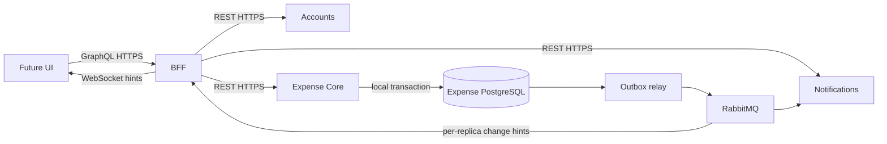

# Architecture and ownership

## Deployables

| Application | Modules | Authoritative data |
|---|---|---|
| Accounts | Identity linkage, profiles, preferences, lifecycle | OIDC subject mapping, profile and account settings |
| Expense Core | Groups, participants/invitations, expenses/allocation, ledger, repayments, recurrence, audit, synchronization | Every financial record, membership authorization, group revision, outbox |
| Notifications | Inbox, preferences, delivery, reminders | Inbox items, channel preferences, consumer deduplication and delivery attempts |
| BFF | Authentication adapter, REST clients, resolvers, subscriptions | No financial persistence; ephemeral connections only |

Three REST services plus a BFF are the launch boundary, not a claim that more
services imply more scale. Financial state remains together because expense,
posting, balance, audit, sync change and outbox must commit atomically. Notification
outages cannot roll back financial writes. Accounts stores general preferences;
Notifications owns channel opt-in and delivery settings, avoiding competing owners.

## Boundaries and deployment

Each service is a modular monolith in one independent Gradle application project.
Organize domain modules into `api`, `application`, `domain`, and `infrastructure`
where useful. Only published module APIs cross module boundaries. Architecture
tests prohibit cycles, domain dependencies on web/persistence adapters, and
cross-service entities/repositories. Do not create empty packages just to match a
pattern. Application services own transaction boundaries; controllers do not.

Each stateful service owns a PostgreSQL database, credentials and Flyway migrations.
Initially these databases may share a cluster to limit operating cost. Cross-service
SQL, database foreign keys and shared persistent domain models are prohibited.
The BFF accesses only REST and event infrastructure. Shared libraries contain
technical configuration rather than business rules or service-to-service DTOs.

Clients authenticate with OIDC. Resource services validate signed access tokens
and enforce their own authorization; the BFF is not the security boundary. Internal
workers use scoped identities. Account lifecycle work must preserve attributable
financial history while applying the eventual launch-market retention policy.

REST owns commands and authoritative reads; RabbitMQ delivers committed effects.
Events carry versioned envelopes and minimal data. WebSocket notifications are
hints; snapshot/change-feed synchronization is the recoverable source. Replicas
receive independent fan-out queues, not one load-balanced notification queue.

## Scale without premature decomposition

Start with stateless replicas, bounded connection pools, indexed PostgreSQL reads
and worker concurrency controls. Observe hot-group write contention, outbox lag,
subscription connections and memory, database time and email cost. Export or receipt
processing can become independently scaled modules/services when measured needs
justify it. Reporting projections/read replicas, Redis, Kafka, sharding and
multi-region writes are deliberately deferred. A million monthly users is not a
workload specification: capacity claims require measured operation mix and peaks.
