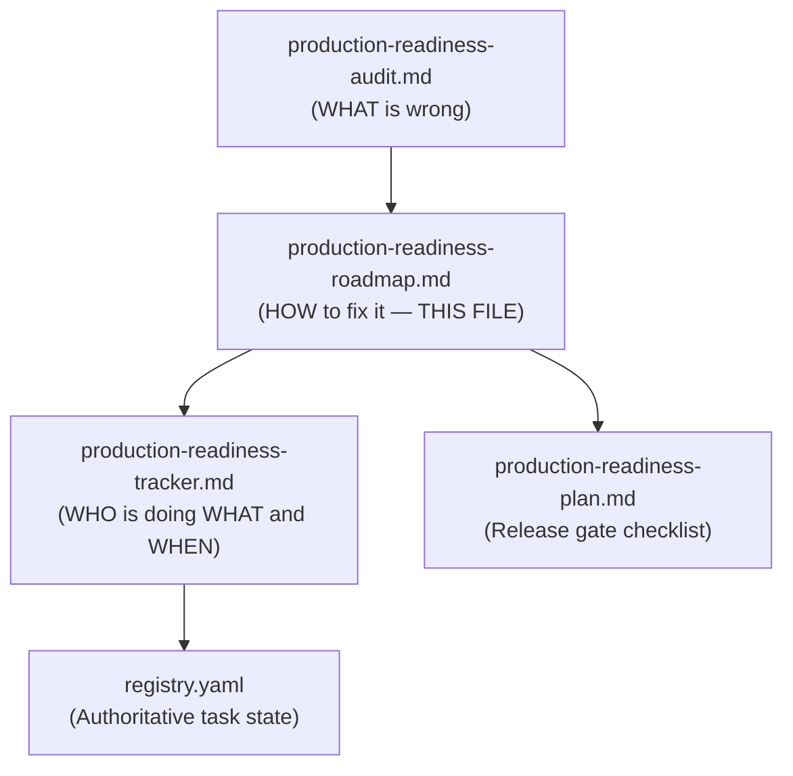
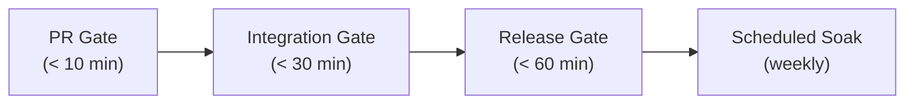
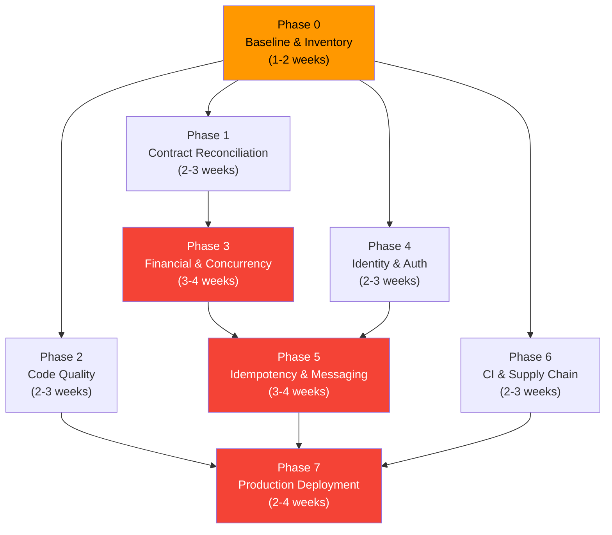

# Production Readiness Implementation Roadmap

> **Last updated**: 2026-09-20
> **Target**: 1–10 million DAU backend deployment
> **Status**: Planning document — not yet registered in `docs/tasks/registry.yaml`

## How to read this document

This roadmap converts the [production-readiness audit](../reviews/production-readiness-audit.md)
into an **executable, evidence-driven program**. It is organized into 8 phases
with clear dependencies, so work can be parallelized safely.

> [!IMPORTANT]
> This is a **planning document**. It does not claim that any item is
> implemented or that the product is approved for production. The authoritative
> task state remains `docs/tasks/registry.yaml`; the coordinator must register
> work items there before implementation begins.

### Who should read this

- **Coordinator / Project Lead**: To understand the full scope and register tasks
- **Individual Contributors**: To understand what their phase covers and what
  "done" looks like
- **New team members / Interns**: Every section is self-explanatory with design
  pattern references

### Document relationships



---

## Table of contents

- [Definition of done for the program](#definition-of-done-for-the-program)
- [Governing principles](#governing-principles)
- [Scale context: what 1–10M DAU means](#scale-context-what-110m-dau-means)
- [Phase plan](#phase-plan)
  - [Phase 0 — Baseline and inventory](#phase-0--baseline-and-inventory)
  - [Phase 1 — Design and contract reconciliation](#phase-1--design-and-contract-reconciliation)
  - [Phase 2 — Code quality and design hardening](#phase-2--code-quality-and-design-hardening)
  - [Phase 3 — Domain, financial, and concurrency hardening](#phase-3--domain-financial-and-concurrency-hardening)
  - [Phase 4 — Identity and authorization hardening](#phase-4--identity-and-authorization-hardening)
  - [Phase 5 — Idempotency, offline replay, and messaging reliability](#phase-5--idempotency-offline-replay-and-messaging-reliability)
  - [Phase 6 — CI and supply-chain enforcement](#phase-6--ci-and-supply-chain-enforcement)
  - [Phase 7 — Production-like deployment and capacity proof](#phase-7--production-like-deployment-and-capacity-proof)
- [Phase dependency graph](#phase-dependency-graph)
- [Required evidence format](#required-evidence-format)
- [Design patterns and principles quick reference](#design-patterns-and-principles-quick-reference)
- [Explicit non-goals](#explicit-non-goals)

---

## Definition of done for the program

The program is complete **only when ALL of the following are true**:

| # | Criterion | Why it matters at scale | How to verify |
|:---:|---|---|---|
| 1 | Every public operation has contract, implementation, authorization, failure, concurrency, replay, side-effect, and live evidence at the required level | At 10M DAU, every edge case becomes a daily event | Evidence matrix shows pass for every operation × dimension |
| 2 | Every financial invariant has deterministic, persistence, concurrency, and recovery evidence | Money bugs destroy user trust irreversibly | Reconciliation script returns zero discrepancies |
| 3 | Authentication and authorization are verified across REST, GraphQL, WebSocket, and workers | One unprotected endpoint = data breach | Authorization matrix has positive AND negative evidence for every path |
| 4 | Outbox and broker behavior is proven under duplicate delivery, retry, poison messages, broker failure, and restore | At 1M+ DAU, message infrastructure failures happen weekly | Broker failure test + replay reconciliation pass |
| 5 | CI enforces code quality, architecture boundaries, duplication control, configuration hygiene, supply-chain security, contracts, tests, and artifacts | Without gates, quality degrades with every PR | Fresh checkout → CI → all gates pass → immutable artifact |
| 6 | Production-like load, soak, failover, restore, rollback, and alert-routing evidence meets approved SLO/RPO/RTO targets | Local Docker ≠ production | 60-minute soak test with real topology passes SLOs |
| 7 | All exceptions have an owner, mitigation, expiry date, and explicit release approval | Undocumented exceptions become permanent risks | Exception register has zero entries without owner/expiry |

---

## Governing principles

These principles are **non-negotiable**. If you're unsure whether your
implementation follows them, stop and verify.

| # | Principle | What it means in practice | Design pattern reference |
|:---:|---|---|---|
| 1 | **The smallest authoritative source owns each rule** | Don't duplicate validation in controllers and services. Don't copy version numbers. Don't repeat error codes. | **DRY** (Don't Repeat Yourself), **Single Source of Truth** |
| 2 | **A passing unit test cannot substitute for persistence, transport, or live dependency evidence** | Testing an in-memory HashMap doesn't prove PostgreSQL behavior. Testing localhost doesn't prove network behavior. | **Testing Pyramid** — unit → integration → E2E → production |
| 3 | **Local Compose is development, not production capacity evidence** | Your laptop running Docker is not the same as 3 replicas behind a load balancer with managed PostgreSQL | **Environment Parity Principle** — measure in production-like topology |
| 4 | **Security and financial-integrity failures are release blockers** | No exception. No workaround. No "we'll fix it later." | **Fail-Closed Security**, **Defense in Depth** |
| 5 | **Every new endpoint, event, migration, configuration key, and alert requires documentation and tests in the same increment** | Don't merge code without tests. Don't merge features without docs. | **Continuous Documentation**, **Test-Driven Development** |
| 6 | **Implementation tasks must remain independently reviewable and have disjoint owned paths or an explicit handoff** | Two people editing the same file = merge conflicts and confusion | **Single Responsibility Principle** applied to task ownership |

---

## Scale context: what 1–10M DAU means

Before diving into phases, understand the operational reality of the target
scale. These numbers drive every design decision in this roadmap.

### Traffic model

| Metric | 1M DAU | 5M DAU | 10M DAU |
|---|---:|---:|---:|
| Avg requests/second (sustained) | ~115 | ~580 | ~1,157 |
| Peak requests/second (10x burst) | ~1,157 | ~5,787 | ~11,574 |
| Daily mutations (expenses, settlements) | ~500K | ~2.5M | ~5M |
| Daily events (outbox → broker) | ~1M | ~5M | ~10M |
| Active WebSocket connections (10% of DAU) | 100K | 500K | 1M |
| Database rows/year (postings) | ~1B | ~5B | ~10B |

### What these numbers mean for engineering

| Scenario | 1M DAU impact | Mitigation |
|---|---|---|
| 0.01% error rate | 1,000 errors/day | Every error path must be tested and monitored |
| 100ms race condition window | ~12 hits/day | All concurrent mutations need locking |
| Unbounded query on 100M row table | Service outage | All queries need pagination and indexes |
| 1 poison message in queue | Blocks all notifications | DLQ with bounded retry required |
| 1 unauthenticated actuator endpoint | Full info disclosure | Defense in depth required |

---

## Phase plan

### Phase 0 — Baseline and inventory

> **Objective**: Freeze the current state and eliminate ambiguity before
> changing any code. You cannot fix what you haven't measured.

**Duration estimate**: 1–2 weeks

**Why this phase exists**: Without a complete inventory of what the system
exposes (endpoints, events, migrations, configuration), you cannot reason
about what is protected, tested, or correct. This phase creates the "map"
that all subsequent phases navigate by.

#### Deliverables

| # | Deliverable | How to produce it | Tool/Command |
|:---:|---|---|---|
| 1 | REST/GraphQL operation inventory | Parse OpenAPI specs and GraphQL schema; list every operation with its HTTP method, path, auth requirement, and implementation status | `python tools/contracts/validate_contracts.py` + manual reconciliation |
| 2 | Authorization matrix | For each operation: who CAN call it (member, admin, service, anonymous) and who CANNOT | Create `docs/security/authorization-matrix.md` |
| 3 | Event and migration inventory | List every RabbitMQ event type and every Flyway migration with version, description, and compatibility status | `SELECT * FROM flyway_schema_history` + event contract scan |
| 4 | Configuration key inventory | Every `application.yml` key mapped to: owner service, default value, environment override, secret status, validation, and rotation procedure | Script scanning all `application*.yml` files |
| 5 | CI gate inventory | Every CI job with: purpose, blocking/non-blocking, timeout, owner, and what it actually checks | Review `.github/workflows/*.yml` |
| 6 | Evidence ledger | Current pass/fail/incomplete/unverified state for every finding in the audit | Create from audit findings with commit metadata |

#### Exit criteria (all must be true to proceed)

- [ ] No operation is missing from the inventory
- [ ] Every open finding has one proposed task ID and owner role
- [ ] No task is marked complete solely from indirect evidence
- [ ] Baseline reports are archived with commit hash and environment metadata

#### Design patterns and principles to follow

- **Inventory Pattern** — exhaustive cataloging before remediation
- **Configuration as Code** — every setting must be traceable
- **Evidence-Based Decision Making** — no assumptions about what "probably works"

---

### Phase 1 — Design and contract reconciliation

> **Objective**: Make externally visible behavior unambiguous before writing
> any implementation code. At 1M+ DAU, unclear API semantics cause cascading
> client-side bugs.

**Duration estimate**: 2–3 weeks
**Dependencies**: Phase 0 complete

**Why this phase exists**: If two clients interpret the same API differently
because the contract is ambiguous, you'll have millions of broken experiences.
This phase ensures every API operation has one unambiguous meaning.

#### Deliverables

| # | Deliverable | Description | Design pattern reference |
|:---:|---|---|---|
| 1 | Consistent problem responses | Every error returns RFC 9457 Problem Detail with stable code, safe message, request ID, error ID | **Error Catalog Pattern** — see [error-flow.md](../architecture/error-flow.md) |
| 2 | Authentication requirements | Every operation explicitly states: public, authenticated, member-of-group, admin, or service | **Authorization Matrix Pattern** |
| 3 | Pagination semantics | Every list endpoint uses keyset cursor pagination with stable ordering and maximum page size | **Keyset Pagination** — see [pagination.md](../architecture/pagination.md) |
| 4 | Idempotency semantics | Every mutation specifies: idempotency key requirement, scope, retention, replay response, conflict behavior | **Idempotent Receiver Pattern** |
| 5 | Retry semantics | Every operation specifies: safe to retry (yes/no), retry-after hint, backoff recommendation | **Retry Pattern** with **Circuit Breaker** awareness |
| 6 | GraphQL error policy | Upstream failures → GraphQL `errors[]` with extensions; partial-result behavior documented; never silently empty | **Error Propagation** through BFF layer |
| 7 | Event compatibility policy | Schema versioning, backward compatibility rules, envelope format, consumer tolerance | **Schema Evolution** — see [contracts/events/](../../contracts/events/) |
| 8 | Migration policy | Expand/contract sequencing, forward-only migrations, rollback procedure | **Expand/Contract Migration Pattern** (see below) |

> 📖 **What is the Expand/Contract Migration Pattern?**
>
> When changing a database schema in a system that can't have downtime:
> 1. **Expand**: Add the new column/table alongside the old one (both old and
>    new code can work)
> 2. **Migrate**: Background job copies data from old → new
> 3. **Contract**: Remove the old column/table (only after all code uses the
>    new one)
>
> This is critical for zero-downtime deployments at scale. Never rename a
> column or change a type in a single migration — old application instances
> (still running during rolling deployment) will crash.

#### Exit criteria

- [ ] Contracts, operation matrix, task details, and implementation agree
- [ ] Breaking-change validation runs in CI
- [ ] Every public error is catalogued and testable
- [ ] Every list endpoint has documented cursor semantics

---

### Phase 2 — Code quality and design hardening

> **Objective**: Enforce clean design and prevent future drift or duplication.
> At 1M+ DAU, technical debt compounds exponentially.

**Duration estimate**: 2–3 weeks
**Dependencies**: Phase 0 complete

**Why this phase exists**: At scale, you deploy multiple times per day. Every
deployment is a risk. Clean code with enforced boundaries reduces risk. This
phase installs the guardrails that keep the codebase maintainable as the team
grows.

#### Deliverables

| # | Deliverable | Description | Design pattern reference |
|:---:|---|---|---|
| 1 | Architecture boundary checks | ArchUnit tests that fail on prohibited dependency directions (e.g., domain → infrastructure, service A → service B entities) | **Dependency Inversion Principle** (SOLID), **Hexagonal Architecture** |
| 2 | Duplication review | Automated detection and remediation of duplicated business rules, validation, error handling, configuration, and test fixtures | **DRY Principle**, **Single Source of Truth** |
| 3 | Source-of-truth map | One authoritative definition for: endpoint paths, error codes, event names, version numbers, configuration keys | **Canonical Data Model** |
| 4 | KDoc/Javadoc coverage | All public classes, interfaces, methods, and non-trivial domain logic documented with `/** ... */` | **Self-Documenting Code** + structured documentation |
| 5 | Stale code cleanup | Remove or register: TODOs, fallbacks, commented-out code, compatibility branches, speculative abstractions | **YAGNI** (You Aren't Gonna Need It) |

> 📖 **What are ArchUnit Tests?**
>
> ArchUnit is a library that lets you write unit tests for your architecture:
> ```kotlin
> @Test
> fun `domain must not depend on infrastructure`() {
>     noClasses()
>         .that().resideInAPackage("..domain..")
>         .should().dependOnClassesThat().resideInAPackage("..infrastructure..")
>         .check(importedClasses)
> }
> ```
> These tests run in CI and fail the build if anyone accidentally imports a
> JPA entity into a domain service, or an Expense Core class into Accounts.

#### Exit criteria

- [ ] CI fails on prohibited dependency direction and forbidden cross-service types
- [ ] Duplicated business rules have one owner or an approved exception with expiry
- [ ] All approved exceptions have owner and review date

---

### Phase 3 — Domain, financial, and concurrency hardening

> **Objective**: Prove correctness under real persistence and concurrent
> execution. This is where money bugs are found and fixed.

**Duration estimate**: 3–4 weeks
**Dependencies**: Phase 1 complete

**Why this phase exists**: Financial applications have the highest correctness
bar. A bug that creates $0.01 of error per user costs $100,000/day at 10M DAU.
Concurrent database access creates race conditions that unit tests never catch.
This phase proves the system is correct under real PostgreSQL with concurrent
transactions.

#### Deliverables

| # | Deliverable | Description | Design pattern reference |
|:---:|---|---|---|
| 1 | PostgreSQL transaction and concurrency suites | Testcontainers-based tests with real PostgreSQL proving transaction isolation, locking, and deadlock handling | **Testcontainers Pattern** — real DB in tests |
| 2 | Financial invariant/property tests | Property-based tests for: zero-sum per group/currency, rounding consistency, overflow rejection, posting completeness | **Property-Based Testing**, **Invariant Checking** |
| 3 | Deadlock/lock-timeout/retry tests | Force and recover from PostgreSQL deadlocks, lock timeouts, connection exhaustion, and serialization failures | **Retry Pattern** with **Exponential Backoff** |
| 4 | Migration tests at representative scale | Run migrations against a database with 1M+ rows; measure duration and verify indexes | **Migration Testing** at scale |
| 5 | Reconciliation procedure | Automated script that verifies: balance = sum(postings), every expense has complete postings, every settlement has postings | **Reconciliation Pattern** (accounting) |

> 📖 **What is Property-Based Testing?**
>
> Instead of writing specific test cases ("test with amount 100"), you define
> properties that must always be true:
> ```kotlin
> @Property
> fun `group balances always sum to zero`(
>     @ForAll amounts: List<@IntRange(min = 1, max = 1_000_000_00) Long>
> ) {
>     // Create expense with these amounts
>     // Assert: SUM(all postings for this group/currency) == 0
> }
> ```
> The testing framework generates hundreds of random inputs and checks the
> property holds for all of them. This catches edge cases you'd never think
> to test manually.

#### Exit criteria

- [ ] Zero-sum, currency, posting, audit, revision, and outbox invariants
      survive concurrent and failure scenarios
- [ ] No unbounded list/query path remains
- [ ] Query counts and indexes are measured for representative data (1M+ rows)
- [ ] Settlement recording produces balance postings (CRIT-01 closed)

#### Key code files to modify

| File | Change | Audit finding |
|---|---|---|
| `SettlementSuggestionEngine` | Include settlement postings in balance aggregation | CRIT-01 |
| `JpaExpenseStore.create()` | Persist and compare idempotency keys | CRIT-02 |
| `ExpenseEntity` | Change payer/allocation to `FetchType.LAZY` | HIGH-13 |
| `ExpenseValidator` / `ExpenseController` | Remove duplicate validation from controller | HIGH-10 |
| `AllocationCalculator` | Add checked arithmetic, reject duplicate participant IDs | HIGH-10, HIGH-18 |
| `GroupEntity.revision` | Add `@Version` or document/enforce row-lock contract | HIGH-20 |

---

### Phase 4 — Identity and authorization hardening

> **Objective**: Make every execution boundary fail closed and auditable.
> A single authentication or authorization bug at 1M DAU is a data breach.

**Duration estimate**: 2–3 weeks
**Dependencies**: Phase 0 complete

#### Deliverables

| # | Deliverable | Description | Design pattern reference |
|:---:|---|---|---|
| 1 | Complete authorization matrix | Generated or centrally maintained matrix covering: identity, membership, lifecycle, resource, replay, and transport dimensions | **RBAC** (Role-Based Access Control) + **ABAC** elements |
| 2 | Provider outage/refresh/rotation tests | JWKS refresh failure, key rotation, clock-skew tolerance, provider unavailability | **Circuit Breaker Pattern** for identity provider |
| 3 | All-boundary identity coverage | REST, GraphQL HTTP, WebSocket, worker, and internal-service paths each have positive and negative evidence | **Defense in Depth** — check at every layer |
| 4 | Abuse/rate-limit policies | Per-user, per-IP, and per-operation rate limits with monitoring | **Token Bucket** or **Sliding Window** rate limiting |
| 5 | Secret rotation runbook | Step-by-step procedure for rotating JWT signing keys, DB credentials, broker credentials, and OIDC secrets without downtime | **Key Rotation Pattern** |

> 📖 **What is the Authorization Matrix?**
>
> A spreadsheet/table where:
> - Rows = every API operation (e.g., `POST /expense-core/v1/groups/{id}/expenses`)
> - Columns = every actor type (anonymous, authenticated, group member, group admin, service, removed member)
> - Cells = expected result (200, 403, 401)
>
> This matrix is the contract. Tests are generated from it. Missing cells are
> bugs. Example:
>
> | Operation | Anonymous | Auth (no group) | Member | Admin | Removed |
> |---|:---:|:---:|:---:|:---:|:---:|
> | Create expense | 401 | 403 | 200 | 200 | 403 |
> | Delete group | 401 | 403 | 403 | 200 | 403 |

#### Key code files to modify

| File | Change | Audit finding |
|---|---|---|
| `AuthSessionConfiguration.kt` | Add `@Profile("test", "local")` | CRIT-03 |
| Security configurations (all services) | Restrict `/actuator/**` | HIGH-02 |
| `ProfileController` | Add tenant/group authorization check | HIGH-01 |
| Group mutation services | Revalidate membership under lock | HIGH-11 |
| All mutation endpoints | Validate participant membership | HIGH-18 |

#### Exit criteria

- [ ] Every protected operation has explicit positive AND negative evidence
- [ ] No test-only identity reaches production-like acceptance
- [ ] Rotation succeeds without invalidating unintended sessions
- [ ] IDOR vulnerability closed (HIGH-01)

---

### Phase 5 — Idempotency, offline replay, and messaging reliability

> **Objective**: Guarantee safe retries and durable asynchronous processing.
> At 1M+ DAU on mobile networks, retries are not edge cases — they're the
> normal operating mode.

**Duration estimate**: 3–4 weeks
**Dependencies**: Phase 1, Phase 3 (financial invariants), Phase 4 (auth)

#### Deliverables

| # | Deliverable | Description | Design pattern reference |
|:---:|---|---|---|
| 1 | Unknown-outcome request tests | Client timeout during expense creation — verify no duplicate posting on retry | **Idempotent Receiver Pattern** |
| 2 | Multi-replica idempotency tests | Two replicas receive the same idempotency key simultaneously — only one succeeds | **Optimistic Locking** with unique constraint |
| 3 | Idempotency retention/cleanup | Expired idempotency records are cleaned up; keys can be reused after retention period | **TTL-Based Cleanup** |
| 4 | RabbitMQ durable/quorum topology | Quorum queues, publisher confirms, mandatory delivery | **Durable Messaging** with **Publisher Confirms** |
| 5 | Consumer bounded retry and DLQ | Max 3 retries → exponential backoff → dead letter exchange → alerting | **Dead Letter Queue Pattern**, **Retry with Backoff** |
| 6 | Event version compatibility | Old consumer + new event, new consumer + old event — both handled gracefully | **Tolerant Reader Pattern**, **Schema Evolution** |

> 📖 **What is the Tolerant Reader Pattern?**
>
> A message consumer should ignore fields it doesn't understand and use
> sensible defaults for missing optional fields. This allows evolving the
> event schema without breaking existing consumers:
> ```kotlin
> // Good: tolerant reader
> val amount = event.optionalField("amount") ?: 0L
> val newField = event.optionalField("newField") // ignored by old consumers
>
> // Bad: strict reader
> val amount = event.requiredField("amount") // breaks if field name changes
> ```

#### Key code files to modify

| File | Change | Audit finding |
|---|---|---|
| `OutboxRelayDaemon.kt` | Remove `InMemoryBroker` fallback | CRIT-04 |
| `NotificationEventConsumer.kt` | Add bounded retry, DLQ, fail-closed preferences | HIGH-05, HIGH-12 |
| `JpaExpenseStore.create()` | Persist idempotency key with unique constraint | CRIT-02 |
| `DeliveryRateLimiter` | Wire into delivery path or remove | HIGH-22 |
| All `InMemory*Store` classes | Add `@Profile("test", "local")` | CRIT-05 |

#### Exit criteria

- [ ] Duplicate requests and events produce no duplicate financial effects
- [ ] Failed consumers recover without loss or unbounded duplication
- [ ] Outbox age, queue lag, retry, and parking alerts are verified
- [ ] Broker node loss does not lose committed events

---

### Phase 6 — CI and supply-chain enforcement

> **Objective**: Make quality and safety repeatable for every change and
> release. At 1M+ DAU, you deploy daily. Without CI gates, every deployment
> is a gamble.

**Duration estimate**: 2–3 weeks
**Dependencies**: Phase 0 complete

#### Deliverables organized by CI stage



| CI Stage | Gate | What it checks | Blocking? | Tool |
|---|---|---|:---:|---|
| **PR Gate** | Compile + unit tests | Code compiles, unit tests pass | ✅ | `./gradlew.bat check` |
| **PR Gate** | Formatting | Spotless code style | ✅ | `./gradlew.bat spotlessCheck` |
| **PR Gate** | Static analysis | Detekt rules, compiler warnings | ✅ | Detekt Gradle plugin |
| **PR Gate** | Architecture tests | ArchUnit boundary checks | ✅ | ArchUnit in test suite |
| **PR Gate** | Contract validation | OpenAPI/GraphQL schema validation | ✅ | `make contracts` |
| **PR Gate** | Python typing | mypy type check on all Python scripts | ✅ | `make python-typecheck` |
| **PR Gate** | Secret scanning | No credentials in source | ✅ | Gitleaks or TruffleHog |
| **Integration Gate** | Integration tests | Testcontainers + real DB/broker | ✅ | `./gradlew.bat test` |
| **Integration Gate** | E2E acceptance | Multi-service live test | ✅ | `make acceptance-live` |
| **Integration Gate** | Coverage threshold | JaCoCo minimum 80% | ✅ | JaCoCo verification task |
| **Integration Gate** | Dependency scan | CVE/vulnerability check | ✅ | OWASP Dependency-Check |
| **Integration Gate** | License compliance | No GPL in MIT project | ✅ | License Gradle plugin |
| **Release Gate** | Container scan | Image vulnerability scan | ✅ | Trivy |
| **Release Gate** | SBOM generation | CycloneDX bill of materials | ✅ | CycloneDX Gradle plugin |
| **Release Gate** | Image signing | Cosign signature on images | ✅ | Cosign |
| **Release Gate** | Migration compatibility | Expand/contract verification | ✅ | Flyway + integration test |
| **Release Gate** | Artifact promotion | Immutable digest, provenance | ✅ | `docker inspect`, Sigstore |
| **Scheduled Soak** | Load test (60 min) | Sustained traffic SLO | ⚠️ Alerting | k6 scripts |
| **Scheduled Soak** | Resilience test | Broker/DB failure recovery | ⚠️ Alerting | Custom scripts |
| **Scheduled Soak** | Alert routing test | Alerts reach on-call | ⚠️ Alerting | PagerDuty/Opsgenie |

#### Exit criteria

- [ ] A clean checkout can reproduce the release candidate
- [ ] Failed tests and scans block promotion (not just generate reports)
- [ ] Reports are retained and linked to commit and image digest
- [ ] CI fixture credentials are generated or clearly isolated from deployment

---

### Phase 7 — Production-like deployment and capacity proof

> **Objective**: Validate the system in an environment representative of
> launch. This is the final gate before shipping to 1M+ users.

**Duration estimate**: 2–4 weeks
**Dependencies**: ALL previous phases substantially complete

**Why this phase exists**: Everything before this phase is engineering
preparation. This phase is the **proof** that the system works at scale.
Without it, you're shipping hope, not evidence.

#### Deliverables

| # | Deliverable | Description | Success criteria |
|:---:|---|---|---|
| 1 | Multi-replica deployment | ≥3 replicas per service behind load balancer | All replicas healthy, traffic distributed |
| 2 | Realistic DB/broker topology | Managed PostgreSQL with replication, RabbitMQ quorum queue cluster | Matches target production topology |
| 3 | 60-minute soak test | Sustained traffic at 1M DAU equivalent (~115 req/s) | p95 < 500ms, p99 < 1s, error rate < 0.1% |
| 4 | Burst test | 10x traffic spike for 5 minutes | Service recovers within 30 seconds after spike |
| 5 | One-replica loss test | Kill one application replica during traffic | Zero errors visible to clients (load balancer routes around) |
| 6 | Broker delay test | Introduce 5-second RabbitMQ latency | Events queue up, no data loss, recovery under 60s |
| 7 | Database failover test | Primary PostgreSQL failure → replica promotion | RPO < 1 minute, RTO < 5 minutes |
| 8 | Backup/PITR/restore test | Point-in-time recovery to specific timestamp | Reconciliation passes after restore |
| 9 | Rollback test | Deploy new version → detect problem → rollback | Old version serves traffic correctly after rollback |
| 10 | Version-skew test | Old and new images running simultaneously | No errors during rolling deployment |
| 11 | Alert routing test | Trigger each alert condition | Correct person receives alert within SLA |
| 12 | On-call rehearsal | Someone other than the author runs the runbook | Runbook is complete and executable |

#### SLO targets for 1M DAU

| Metric | Target | Measurement |
|---|---|---|
| Availability | 99.9% (8.7 hours downtime/year) | Synthetic health checks |
| p50 latency | < 100ms | k6 + Prometheus |
| p95 latency | < 500ms | k6 + Prometheus |
| p99 latency | < 1,000ms | k6 + Prometheus |
| Error rate | < 0.1% | Prometheus error counter |
| RPO (Recovery Point Objective) | < 1 minute | Measured during failover test |
| RTO (Recovery Time Objective) | < 5 minutes | Measured during failover test |
| Outbox age | < 30 seconds | Prometheus gauge |
| Queue lag | < 60 seconds | RabbitMQ management API |

> 📖 **What are RPO and RTO?**
>
> - **RPO** (Recovery Point Objective): How much data can you afford to lose?
>   RPO of 1 minute means you might lose the last 60 seconds of data during
>   a disaster.
> - **RTO** (Recovery Time Objective): How long until the system is back up?
>   RTO of 5 minutes means users experience at most 5 minutes of downtime.
>
> These are measured, not guessed. The failover test in this phase actually
> kills the primary database and measures how long recovery takes and how
> much data is lost.

#### Exit criteria

- [ ] Approved p95/p99/error targets pass in production-like environment
- [ ] Database, broker, JVM, connection pool, queue, and outbox saturation
      remain within limits during 60-minute soak
- [ ] RPO/RTO pass with measured results
- [ ] Release manager signs the final evidence record

---

## Phase dependency graph



**Critical path**: Phase 0 → Phase 1 → Phase 3 → Phase 5 → Phase 7
(~11–17 weeks)

**Parallelizable**: Phase 2, Phase 4, and Phase 6 can run concurrently with
Phase 1 and Phase 3 (they only depend on Phase 0).

---

## Required evidence format

Every task must record evidence using this template. No exceptions.

| Field | Requirement | Example |
|---|---|---|
| **Task** | Registered ID and title | `PR-13: Financial concurrency hardening` |
| **Scope** | Exact behavior and owned paths | "Settlement recording produces balance postings in `app/expense-core/`" |
| **Environment** | Local, CI, staging, or production-like | "Testcontainers PostgreSQL 17, JDK 25, macOS ARM64" |
| **Version** | Commit, image digest, schema/event versions | `commit: abc123, migration: V15, event schema: 2.1` |
| **Command** | Exact reproducible command | `./gradlew.bat :app:expense-core:test --tests "*SettlementPostingTest*"` |
| **Input** | Fixture, data volume, workload, or failure injected | "1,000 concurrent settlement requests against 10 groups" |
| **Result** | Pass/fail and relevant metrics | "All 1,000 requests completed, zero duplicate postings, p99 = 45ms" |
| **Artifacts** | Report, logs, traces, screenshots, reconciliation output | `build/reports/tests/test/index.html`, reconciliation output JSON |
| **Limitation** | What the evidence does NOT prove | "Does not prove behavior under managed PostgreSQL replication" |
| **Reviewer** | Independent reviewer and date | "Jane Doe, 2026-10-15" |

---

## Design patterns and principles quick reference

This section provides a quick lookup for all design patterns and principles
referenced throughout this roadmap. When implementing any phase, check this
table for the relevant pattern.

| Pattern / Principle | What it is | When to use it | Example in Pennywise |
|---|---|---|---|
| **Hexagonal Architecture** (Port/Adapter) | Business logic defines ports (interfaces); adapters implement them | Every service boundary with external systems | `NotificationInboxStore` (port) → `JpaNotificationInboxStore` (adapter) |
| **Transactional Outbox** | Write event + business data in same DB transaction; relay publishes asynchronously | Every outgoing event from a mutation | Expense creation → posting + outbox row in same TX |
| **Idempotent Receiver** | Persist idempotency key atomically with side effect; replay on duplicate | Every mutation endpoint | Expense creation with `Idempotency-Key` header |
| **Keyset Pagination** | Use last row's sort key as cursor instead of OFFSET | Every list endpoint | `WHERE (created_at, id) < (?, ?) LIMIT 20` |
| **Dead Letter Queue** | Park unprocessable messages after bounded retry | Every message consumer | Notification consumer → 3 retries → DLQ |
| **Expand/Contract Migration** | Add new → migrate data → remove old | Every schema change in production | Add column → populate → remove old column |
| **Fail-Closed Security** | Deny access when security state is unknown | Every security decision | Missing OIDC config → refuse to start |
| **Defense in Depth** | Security controls at multiple layers | Every public endpoint | Auth + rate limit + input validation + output sanitization |
| **Single Source of Truth (DRY)** | One authoritative definition for each rule | Every business rule, config, validation | `ExpenseValidator` is THE validation, not controllers |
| **SOLID** | Single Responsibility, Open/Closed, Liskov, Interface Segregation, Dependency Inversion | Every class design decision | One file per entity, repository, service |
| **Property-Based Testing** | Define invariants; framework generates random inputs | Financial calculations, allocation algorithms | Zero-sum balance invariant |
| **Circuit Breaker** | Stop calling a failing dependency temporarily | BFF → downstream services | BFF → Accounts service HTTP calls |
| **Token Bucket** rate limiting | Allow bursts but enforce average rate | API rate limiting, notification delivery | Per-user request rate limit |
| **CQRS** | Separate read and write models | Balance aggregation from posting stream | Postings (write) → balance view (read) |

---

## Explicit non-goals

This roadmap **does not** select or require:

| Non-goal | Why deferred | What IS required |
|---|---|---|
| Cloud provider selection | Business decision, not engineering | Deployment topology must be documented |
| UI framework selection | Separate product decision | `app/web/` reserved, no framework chosen |
| Payment processing | Not in MVP scope | All features remain free |
| Multi-region write architecture | Premature optimization | Single-region with backup/restore evidence |
| Database sharding | Not needed at 10M DAU with proper indexing | Indexed queries with keyset pagination |
| Kubernetes migration | Docker Compose is valid for moderate scale | Deployment manifests with replicas and resources |
| Kafka migration | RabbitMQ is sufficient with quorum queues | Durable messaging with confirms |

Each deferred choice must have a **documented operational boundary** and must
not silently invalidate any capacity or recovery claim made in this program.
