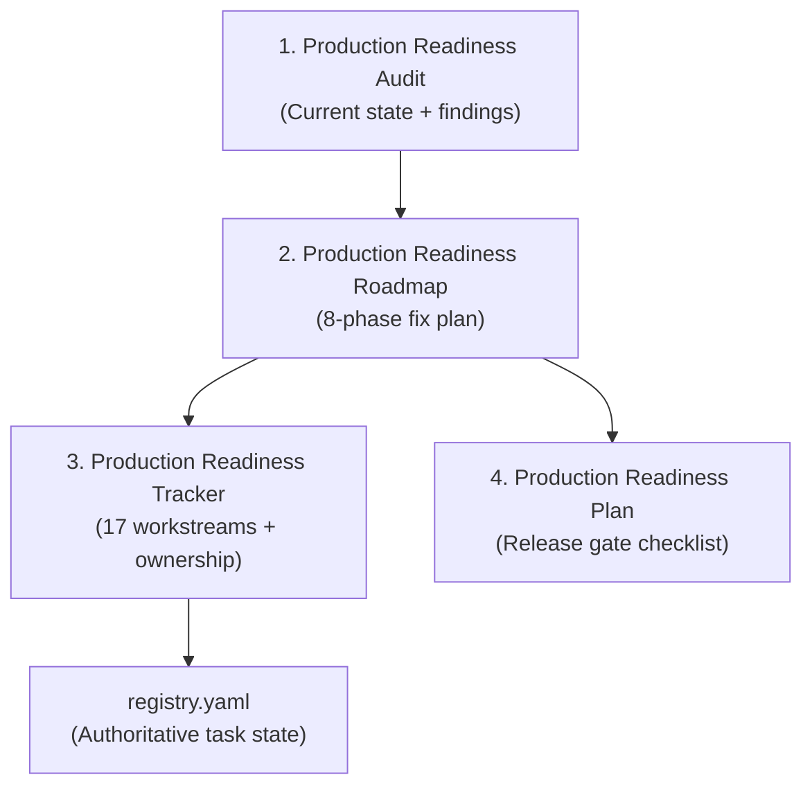

# Operations plan

The first environment is a reproducible Docker Compose stack. It contains one
PostgreSQL cluster with separate service databases, RabbitMQ, and SMTP capture.
OIDC provider selection and provisioning remain external to the current local
topology. Testcontainers provides isolated dependencies for tests; tests never
depend on a developer's persistent Compose state.

Local development has explicit Compose entry points instead of requiring the
largest stack for every task. See [Compose topology](compose-topology.md) for the
dependency-only stack, each native application's prerequisites, the complete
containerized stack, ports, credentials, health checks, and matching Make
commands. [Clone and run](quickstart.md) is the shortest path for a new checkout;
the repository-wide command catalogue is always available through `make help`.

## Production readiness

> [!IMPORTANT]
> The backend is targeting **1–10 million DAU**. The production readiness
> assessment is maintained across four interconnected documents. An intern or
> new team member should read them in this order to understand the complete
> picture.

### Document map

| # | Document | What it answers | Location |
|:---:|---|---|---|
| 1 | **Production Readiness Audit** | "What is wrong and why?" — 5 critical + 24 high-severity findings with code references, scale impact analysis, and design pattern remediation guidance | [`docs/reviews/production-readiness-audit.md`](../reviews/production-readiness-audit.md) |
| 2 | **Production Readiness Roadmap** | "How do we fix it?" — 8 phases with dependencies, deliverables, exit criteria, and ~11–17 week critical path estimate | [`docs/implementation/production-readiness-roadmap.md`](../implementation/production-readiness-roadmap.md) |
| 3 | **Production Readiness Tracker** | "Who is doing what, when?" — 17 workstreams (PR-00 through PR-16) with owner roles, acceptance criteria, cross-cutting rules, and dependency graph | [`docs/tasks/production-readiness-tracker.md`](../tasks/production-readiness-tracker.md) |
| 4 | **Production Readiness Plan** | "Is it ready to ship?" — 9-section pre-launch gate checklist with measurable pass/fail criteria and release approval form | [production-readiness-plan.md](production-readiness-plan.md) |

### Current status

The production-readiness audit **does not approve** production launch. The
current classification is:

> Feature-rich backend under active hardening; suitable for continued
> development and controlled testing. Not approved for public production or
> a 1M+ user capacity guarantee.

### Additional operations documents

| Document | Purpose |
|---|---|
| [Production hardening](production-hardening.md) | Observability, error attribution, metric cardinality, and release hardening requirements |
| [Compose topology](compose-topology.md) | Local development Docker Compose topology |
| [Quickstart](quickstart.md) | Clone-and-run guide for new developers |
| [CI](ci.md) | Continuous integration pipeline documentation |

## Production deployment

Production begins as stateless pinned containers behind a load balancer, with
managed PostgreSQL and RabbitMQ where possible. The deployment must provide TLS,
private service networking, scoped secrets, health/readiness endpoints, graceful
shutdown, and expand/contract migrations. A migration runs before an application
rollout and rollback uses a previously tested image digest.

Observe request success/latency, database pool saturation, outbox age, queue
lag/retries, dead letters, sync resets, subscription counts, recurring backlog,
and reconciliation results. Never put descriptions, tokens, invitation secrets,
or raw financial values into routine logs or metric labels.

Backups and restoration are launch gates. Restore into an isolated environment,
reconcile every group/currency, and verify outbox replay is duplicate-safe. Load
testing must define operation mix, hot groups, reconnect storms, and cost; one
million monthly users is an ambition, not evidence of capacity.

The production reference at `infra/deploy/docker-compose.prod.yml` is intended
for a private network behind an external TLS/load-balancing layer. It checks
`/actuator/health/readiness` before traffic, emits structured logs, forwards
termination signals, and allows graceful shutdown. Inject separate,
least-privilege credentials per service through the deployment platform; never
commit certificates, tokens, passwords, or broker credentials.

Run expand migrations before image rollout and keep the old immutable digest
available for rollback. Compose documents the topology but does not provision
cloud resources or managed PostgreSQL, RabbitMQ, TLS, or OTLP infrastructure.
