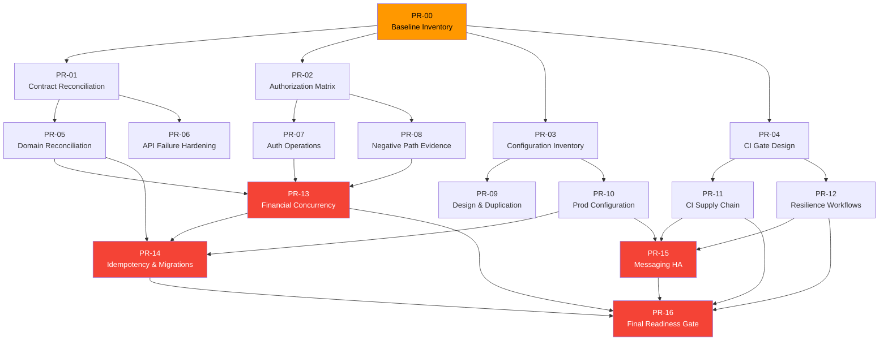

# Production Readiness Workstream Tracker

> **Last updated**: 2026-09-20
> **Status**: Proposed — pending coordinator registration in `docs/tasks/registry.yaml`

## How to read this document

This tracker converts audit findings and roadmap phases into **actionable
workstreams** with clear ownership, dependencies, acceptance criteria, and
evidence requirements. It is organized so that any team member — including
someone with zero context — can understand:

1. **What** each workstream covers (scope)
2. **Why** it matters (link to audit finding and scale impact)
3. **Who** should own it (role, not person)
4. **What files** to modify (owned paths)
5. **What "done" looks like** (acceptance criteria with measurable outcomes)
6. **What evidence to produce** (artifacts)
7. **What it depends on** (no starting until dependencies are met)
8. **What design patterns to apply** (implementation hints)

> [!IMPORTANT]
> This tracker is a **proposed implementation tracker** for coordinator
> registration. It is **not authoritative task state** until copied into
> `docs/tasks/registry.yaml` and `docs/tasks/board.md` by the coordinator.
>
> The proposed `PR-*` identifiers are planning containers, not permission to
> duplicate existing tasks. Before registration, the coordinator must either
> attach each workstream to existing tasks or create new child tasks only for
> scope that is genuinely absent.

### Status vocabulary

| Status | Meaning | Requirements |
|---|---|---|
| `proposed` | Defined in this document but not yet registered | Coordinator review needed |
| `planned` | Registered in `registry.yaml` with assigned owner | Owner must update task detail before implementation |
| `in_progress` | Implementation actively underway | Owner provides regular evidence updates |
| `blocked` | Cannot proceed due to dependency or external factor | Blocker documented with resolution path |
| `done` | All acceptance criteria met with evidence | Evidence reviewed by independent reviewer; `done` requires evidence, review, and documented limitations — code existing in the repository is not sufficient |

---

## Table of contents

- [Existing task reconciliation](#existing-task-reconciliation)
- [Status integrity rules](#status-integrity-rules)
- [Dependency graph](#dependency-graph)
- [Cross-cutting rules](#cross-cutting-rules)
- [Workstream records (PR-00 through PR-16)](#workstream-records)
- [Tracker update protocol](#tracker-update-protocol)
- [Status review cadence](#status-review-cadence)

---

## Existing task reconciliation

> [!WARNING]
> The current registry contains **147 tasks** and already marks several local
> or planning increments complete. That status must **not** be silently changed
> by this document. The coordinator should reconcile each completion claim
> against the evidence requirements before registering new children.

The table below maps each proposed workstream to existing tasks. The coordinator
must decide whether to **extend** an existing task or **create** a narrow child
task for genuinely absent scope.

| Proposed workstream | Existing related task(s) | Reconciliation decision |
|---|---|---|
| PR-00 — Baseline inventory | QA-07, QA-08 | Use QA-08 for production evidence; inventory is its evidence artifact |
| PR-01 — Contract reconciliation | DOC-16, DOC-18, QA-07 | Reopen or add children only for operation-level gaps not already covered |
| PR-02 — Authorization matrix | AUTH-03 through AUTH-07, QA-07 | Preserve completed security evidence; add only missing matrix dimensions |
| PR-03 — Configuration inventory | OPS-03, OPS-08, AUTH-03, AUTH-07 | Consolidate configuration ownership before adding new keys |
| PR-04 — CI gate design | FND-03, OPS-04 through OPS-06, OPS-24 | Extend existing CI tasks rather than creating parallel workflows |
| PR-05 — Domain reconciliation | DOC-15, DOC-15A, DOC-15B, FND-08 | Reopen inaccurate completion claims or register narrowly scoped corrections |
| PR-06 — API failure compatibility | ERR-01 through ERR-12, BFF-06/BFF-07 | Use existing error and BFF tasks; register only uncovered behavior |
| PR-07 — Auth operations | AUTH-07, QA-08 | Production provider and rotation evidence belongs in QA-08 unless code scope changes |
| PR-08 — Negative/replay evidence | QA-07, QA-08, QA-05 | Separate local evidence from production-like evidence |
| PR-09 — Design/duplication | FND-08, DOC-20, DOC-15B | Extend architecture and quality gates; do not duplicate FND-08 |
| PR-10 — Production configuration | OPS-01, OPS-03, OPS-08, OPS-20 | Keep deployment-specific evidence under OPS-20/QA-08 |
| PR-11 — CI supply chain | OPS-04, OPS-05, OPS-11, OPS-12, OPS-15 | Add missing scan/SBOM/signing children only after confirming no existing task owns them |
| PR-12 — Resilience workflows | OPS-20 through OPS-23, QA-08 | QA-08 is the planned production-like execution task |
| PR-13 — Financial concurrency | CORE-22, CORE-23, CORE-25, QA-07 | Preserve completed local concurrency evidence; add production-scale gaps |
| PR-14 — Idempotency/migrations | CORE-24/25, OPS-01, QA-08 | Verify version skew and rollback explicitly |
| PR-15 — Messaging HA | MSG-01, MSG-02, OPS-20, QA-08 | Existing local broker evidence does not close production HA evidence |
| PR-16 — Final gate | OPS-20, QA-08 | Do not mark complete until target-environment evidence exists |

---

## Status integrity rules

> [!CAUTION]
> These rules prevent the most dangerous mistake in production readiness
> tracking: **upgrading a local test result to a production claim by changing
> the wording.**

| Evidence level | What you CAN claim | What you CANNOT claim |
|---|---|---|
| Unit or module tests | "Behavior passes in the tested module" | "Production correctness" or "capacity proven" |
| Local Docker integration | "Local service interaction and recovery observed" | "Target-environment HA, RPO/RTO, or availability" |
| Local load test | "Host-specific throughput and latency measured" | "1M-user readiness" or "production SLO compliance" |
| Production-like isolated environment | "Measured behavior for the declared topology and workload" | "Generalization beyond the measured envelope" |
| Approved target environment | "Release-specific operational evidence" | "Permanent guarantee without recurring verification" |

### Practical example of violation

❌ **Wrong**: "OPS-20 local Docker recovery test passed → production recovery
is proven"

✅ **Correct**: "OPS-20 local Docker recovery test passed for the local
topology. Production recovery (QA-08) requires separate evidence in the target
environment with managed PostgreSQL, RabbitMQ cluster, and multi-replica
deployment."

---

## Dependency graph

```text
PR-00 baseline
  ├── PR-01 contract reconciliation
  ├── PR-02 authorization matrix
  ├── PR-03 configuration/source-of-truth inventory
  └── PR-04 CI gate design

PR-01 ─┬─ PR-05 domain and API implementation reconciliation
       └─ PR-06 GraphQL/REST failure and compatibility hardening
PR-02 ─┬─ PR-07 authentication and authorization hardening
       └─ PR-08 public negative-path and replay evidence
PR-03 ─┬─ PR-09 clean design and duplication enforcement
       └─ PR-10 production configuration hardening
PR-04 ─┬─ PR-11 CI supply-chain and artifact controls
       └─ PR-12 integration, resilience, and scheduled capacity workflows

PR-05 + PR-07 + PR-08 ── PR-13 financial correctness and concurrency
PR-05 + PR-10 + PR-13 ── PR-14 idempotency and migration compatibility
PR-10 + PR-11 + PR-12 ── PR-15 messaging HA and recovery evidence
PR-11 + PR-12 + PR-13 + PR-14 + PR-15 ── PR-16 production-like readiness gate
```



---

## Cross-cutting rules

These rules apply across **multiple workstreams** and are not tracked as
separate tasks. Each relevant workstream owner must address these within
their scope.

### Rule: Bounded reads and pagination

> **Applies to**: PR-02, PR-03, PR-09, PR-13
> **Audit finding**: HIGH-03 (unbounded database queries)
> **Design pattern**: **Keyset Pagination**

Current evidence shows unconstrained repository `List` queries for:
- Group memberships
- Recurring schedules and occurrences
- Balance postings
- Search results and export requests
- Notification inbox items

**Specific code issues**:
- `JpaExpenseStore.list()` loads ALL matching expenses and applies `take(limit)`
  after the query; the cursor parameter is **not applied to SQL**
- JPA notification inbox loads and sorts the **complete subject history** before
  slicing a page
- `outbox.snapshot()` reads ALL rows (must be admin-only, never in request or
  health paths)

**What each owner must do**:
1. Define maximum response sizes (e.g., 100 items per page)
2. Implement stable cursor semantics (keyset-based, not offset-based)
3. Push pagination predicates to SQL (`WHERE (sort_key, id) < (?, ?) LIMIT ?`)
4. Create supporting indexes for each cursor key combination
5. Add abuse tests with large datasets
6. Measure query plans and heap usage

**Acceptance**: Query plans, large-group load evidence, and proof that heap
and tail latency remain within SLO.

---

### Rule: Configuration fail-closed

> **Applies to**: PR-03, PR-10, PR-15
> **Audit finding**: HIGH-23 (feature flags default to disabled)

Capabilities required for correctness must **not** default to silently disabled.

Current violations:
- `pennywise.outbox.enabled` defaults to `false`
- `pennywise.auth-email-outbox.enabled` defaults to `false`

**What each owner must do**: Production profiles must explicitly activate
durable publication **or fail startup**. Add Spring context tests covering
both missing and disabled configuration.

---

### Rule: Authorization for profile lookups

> **Applies to**: PR-02, PR-07
> **Audit finding**: HIGH-01 (IDOR vulnerability)

Profile lookup by arbitrary account UUID currently has **no caller/group
relationship check** beyond authentication. Any authenticated user who obtains
an account UUID can retrieve another user's profile.

**What each owner must do**:
1. Close IDOR risk for both single and batch lookups
2. Define the service-to-service exception (if one is intended)
3. Minimize returned fields (display name only for shared-group members)
4. Prove cross-tenant denials with negative tests

---

### Rule: Privacy and deletion

> **Applies to**: PR-02, PR-10, PR-14
> **Audit finding**: HIGH-17 (deletion is only a flag)

Account deletion currently records a request and marks the profile but does
**not** demonstrate end-to-end erasure or pseudonymization across services.

**What each owner must do**:
1. Define the retention exception for financial attribution
2. Implement an idempotent deletion workflow across services
3. Prove completion audit, credential/session invalidation, export/inbox
   handling, and redaction
4. Do not advertise privacy readiness until tested

---

### Rule: Participant membership validation

> **Applies to**: PR-05, PR-08, PR-13
> **Audit finding**: HIGH-18 (participant IDs not validated)

Caller membership does **not** authorize arbitrary payer, allocation, or
settlement participant UUIDs. Every participant must be validated against
active group membership/placeholder state inside the mutation transaction.

All allocation modes must reject duplicate IDs rather than silently collapsing
them (`AllocationCalculator.associate` in exact/percentage/weighted modes
currently collapses duplicates).

---

### Rule: Settlement financial integrity

> **Applies to**: PR-05, PR-13
> **Audit finding**: CRIT-01 (settlement not in balance model)

Repayment record/reversal must:
1. Produce balance postings that feed the same aggregation query as expenses
2. Commit atomically with audit trail and outbox event
3. Support request idempotency (settlement recording has none currently)
4. Appear in reconciliation evidence

---

### Rule: Idempotency enforcement

> **Applies to**: PR-05, PR-13, PR-14
> **Audit finding**: CRIT-02 (idempotency keys ignored)

Every mutation must persist and enforce: idempotency key, operation scope,
actor/group binding, canonical payload hash, replay response, and conflict
behavior.

**Current violations**:
- Expense creation accepts but ignores the idempotency key
- Expense ID lookup happens before group ownership check
- Settlement recording has no idempotency key at all

---

### Rule: Recurring worker safety

> **Applies to**: PR-05, PR-13
> **Audit finding**: HIGH-04 (worker concurrency unsafe)

Due schedules must be claimed/locked in bounded batches with explicit
concurrency/idempotency protocol. A unique occurrence key alone does not
protect schedule state transitions or notification side effects.

`maxCatchUpOccurrences` must have startup validation with a positive upper
bound and be covered by multi-worker tests.

---

### Rule: Consumer bounded retry

> **Applies to**: PR-12, PR-15
> **Audit finding**: HIGH-12 (poison message loops)

Every Rabbit consumer needs:
1. Bounded retry/redelivery metadata (max 3 attempts)
2. Delayed retry with exponential backoff
3. Dead letter exchange after max retries
4. Idempotent acknowledgement
5. Observable parking (alerting on DLQ depth)
6. Recovery tests proving healthy messages are not starved by a poison event

---

### Rule: Membership authorization under lock

> **Applies to**: PR-02, PR-07, PR-13
> **Audit finding**: HIGH-11 (authorization race condition)

Membership authorization must be revalidated **under the same group
lock/transaction** used for mutation. A pre-lock check can race with removal.

Cover removal races for: rename, archive, invites, placeholders, expenses,
settlements, and recurring schedules.

---

### Rule: Optimistic locking contract

> **Applies to**: PR-05, PR-13
> **Audit finding**: HIGH-20 (broken locking contract)

`GroupEntity.revision` is documented as optimistic-locking state but is **not**
a JPA `@Version` field. Choose and prove one consistent locking contract with
monotonic-revision conflict tests.

---

### Rule: In-memory adapter hygiene

> **Applies to**: PR-03, PR-10, PR-15
> **Audit finding**: CRIT-05 (in-memory persistence in production)

Production-like contexts may **not** rely on constructor default arguments or
localhost email defaults to select process-local stores/adapters. Durable
persistence and externally configured email delivery must be mandatory.

---

### Rule: BFF configuration safety

> **Applies to**: PR-03, PR-10
> **Audit finding**: HIGH-15 (BFF downstream URL defaults)

Production BFF profiles must **not** default downstream service URLs to
localhost. Accounts and Expense Core endpoints must be required, validated, and
tested for missing, malformed, and disallowed targets.

---

### Rule: Request boundary enforcement

> **Applies to**: PR-05, PR-06, PR-09
> **Audit finding**: HIGH-19 (request size limits missing)

Shared DTO limits must bound: payer/allocation cardinality, category/identifier
lengths, numeric magnitude, request bodies, headers, and idempotency keys.
Enforce before domain allocation/multiplication.

---

### Rule: Error boundary safety

> **Applies to**: PR-06, PR-09
> **Audit finding**: HIGH-14 (error message disclosure)

Public problem responses must use stable safe messages and codes. Raw exception
messages may **not** be copied into API title/detail fields. Tests must verify
SQL, parser, identity-provider, and credential failures are redacted.

---

### Rule: BFF abuse controls

> **Applies to**: PR-06, PR-10
> **Audit finding**: HIGH-16 (GraphQL abuse controls missing)

GraphQL depth/complexity, request size, subscription count, message rate, and
per-subject quotas must be explicit configuration enforced in code. Tests must
prove rejection under adversarial queries and connection churn.

---

### Rule: Test fault injection removal

> **Applies to**: PR-09, PR-10
> **Audit finding**: HIGH-09 (test fault injection in production)

`X-Acceptance-Fault` handling must be test-profile-only or removed from
production artifacts. The security gate must also prove that membership
revocation invalidates existing GraphQL subscriptions.

---

### Rule: Notification rate limiting

> **Applies to**: PR-09, PR-15
> **Audit finding**: HIGH-22 (unused rate limiter)

The existing `DeliveryRateLimiter` is not wired into production delivery and
is process-local. Either integrate a bounded, concurrency-safe rate limit or
remove the unused claim.

---

### Rule: CI enterprise gates

> **Applies to**: PR-04, PR-11
> **Audit finding**: HIGH-08 (no CI security gates)

The enterprise CI gate must enforce: static analysis, architectural boundary
checks, dependency vulnerability/license scanning, secret scanning,
SBOM/provenance output, and a configured coverage threshold. Any CI fixture
secret exception must be explicit, scoped to test-only use, and expire on a
recorded date.

---

## Workstream records

### PR-00 — Baseline inventory and evidence ledger

| Field | Value |
|---|---|
| **Owner role** | Coordinator / Quality |
| **Dependencies** | None |
| **Owned paths** | `docs/quality/`, `docs/operations/`, `docs/tasks/` |
| **Status** | `proposed` |
| **Roadmap phase** | Phase 0 |
| **Audit findings addressed** | Foundation for all findings |
| **Estimated effort** | 1–2 weeks |

**Scope**: Inventory ALL public operations, events, migrations, configuration
keys, tests, CI jobs, and existing evidence. Classify every finding as proven,
contradicted, incomplete, or unverified.

**Acceptance criteria**:
- [ ] 100% of REST (45 operations), GraphQL (9 roots), and WebSocket surfaces
      inventoried with implementation status
- [ ] Every audit finding classified with evidence level (1–5)
- [ ] Every open item has proposed owner and dependency
- [ ] No completion claim relies on a local-only result without qualification
- [ ] Baseline reports archived with commit hash and environment metadata

**Evidence required**: Generated inventory, baseline report, reviewed commit.

**Design patterns**: Inventory Pattern, Evidence-Based Decision Making.

---

### PR-01 — Contract and operation reconciliation

| Field | Value |
|---|---|
| **Owner role** | Contracts / Coordinator |
| **Dependencies** | PR-00 |
| **Owned paths** | `contracts/`, `docs/api/`, `docs/quality/public-interface-*` |
| **Status** | `proposed` |
| **Roadmap phase** | Phase 1 |
| **Audit findings addressed** | Contract gaps, pagination semantics, error policy |
| **Estimated effort** | 2–3 weeks |

**Scope**: Reconcile status markers, common responses, auth requirements,
pagination, error behavior, retryability, idempotency, and event compatibility.
Ensure every public operation has unambiguous semantics.

**Acceptance criteria**:
- [ ] Every operation has explicit request, response, auth, validation, and
      error semantics documented in the contract
- [ ] GraphQL mapping and REST contracts agree (no semantic drift)
- [ ] Breaking-change and schema validation pass in CI
- [ ] Operation matrix has no unexplained stale/planned claims
- [ ] Pagination cursor semantics defined for every list endpoint

**Evidence**: Validator output, breaking-change report, reviewed contract diff.

**Design patterns**: Contract-First Design, Error Catalog Pattern
(see [error-flow.md](../architecture/error-flow.md)), Keyset Pagination
(see [pagination.md](../architecture/pagination.md)).

---

### PR-02 — Authorization matrix

| Field | Value |
|---|---|
| **Owner role** | Security / Quality |
| **Dependencies** | PR-00 |
| **Owned paths** | `docs/security/`, `docs/quality/`, `tests/e2e/`, `tools/` |
| **Status** | `proposed` |
| **Roadmap phase** | Phase 4 |
| **Audit findings addressed** | HIGH-01, HIGH-11, HIGH-18, HIGH-21 |
| **Estimated effort** | 2–3 weeks |

**Scope**: Create a generated or centrally maintained authorization matrix
covering: identity, membership, lifecycle, resource, replay, and transport
dimensions. Every protected operation must have positive AND negative test
cases.

> 📖 **What the matrix looks like**: See the authorization matrix example in
> the [production-readiness-roadmap.md](../implementation/production-readiness-roadmap.md#phase-4--identity-and-authorization-hardening)
> Phase 4 section.

**Acceptance criteria**:
- [ ] All protected operations map to positive and negative cases
- [ ] REST, GraphQL HTTP, WebSocket, and worker paths included
- [ ] Missing matrix rows fail CI for new public operations
- [ ] Profile IDOR vulnerability (HIGH-01) closed
- [ ] Membership removal races tested (HIGH-11)
- [ ] Participant ID membership validation enforced (HIGH-18)
- [ ] Subscription revocation on removal tested (HIGH-21)

**Evidence**: Matrix report, negative-path test output, CI gate.

**Design patterns**: RBAC (Role-Based Access Control), Defense in Depth,
Principle of Least Privilege.

---

### PR-03 — Configuration and source-of-truth inventory

| Field | Value |
|---|---|
| **Owner role** | Architecture / Operations |
| **Dependencies** | PR-00 |
| **Owned paths** | `docs/architecture/`, `docs/operations/`, `infra/`, `Makefile` |
| **Status** | `proposed` |
| **Roadmap phase** | Phase 0 / Phase 2 |
| **Audit findings addressed** | CRIT-03, CRIT-04, CRIT-05, HIGH-07, HIGH-15, HIGH-23 |
| **Estimated effort** | 2 weeks |

**Scope**: Map every configuration key to: owner, default, environment, secret
status, validation, consumer, and rotation procedure. Identify and remediate
all fail-open defaults.

> [!CAUTION]
> **Critical finding**: In-memory persistence adapters are registered as
> application services alongside JPA adapters, including notification inbox
> and Accounts profile paths. Some services declare in-memory constructor
> defaults. Production adapter selection must be explicit and durable; test
> stores must be profile/conditional fixtures only.

**Acceptance criteria**:
- [ ] No production secret has a fallback value
- [ ] No production service can select an in-memory persistence adapter
- [ ] No dependency version is duplicated outside the approved source
      (`gradle/libs.versions.toml`)
- [ ] Safe defaults, overlays, and secret injection are separated
- [ ] Rendered target configuration is reviewable without exposing secret values
- [ ] BFF downstream URLs are required (not defaulting to localhost)
- [ ] Outbox and auth-email-outbox flags fail closed in production

**Evidence**: Configuration catalog, rendered config checks, secret hygiene output.

**Design patterns**: Configuration as Code, Fail-Fast Principle, Hexagonal
Architecture (adapter selection via DI profiles), Twelve-Factor App (Config).

---

### PR-04 — CI gate architecture

| Field | Value |
|---|---|
| **Owner role** | Platform / Quality |
| **Dependencies** | PR-00 |
| **Owned paths** | `.github/workflows/`, `Makefile`, `docs/operations/ci.md` |
| **Status** | `proposed` |
| **Roadmap phase** | Phase 6 |
| **Audit findings addressed** | HIGH-08 |
| **Estimated effort** | 2–3 weeks |

**Scope**: Define fast PR gates, full integration gates, scheduled resilience
workflows, and release gates with artifact retention and failure ownership.

**Acceptance criteria**:
- [ ] Each gate has a purpose, timeout, owner, and blocking policy
- [ ] Reports are tied to commit hash and image digest
- [ ] Local commands and hosted workflows have documented parity
- [ ] No gate claims production evidence from local fixtures
- [ ] All gates documented in the CI stage table (see roadmap Phase 6)

**Evidence**: Workflow map, YAML validation, dry-run or hosted run links.

**Design patterns**: Shift-Left Security, Continuous Integration, Pipeline
as Code.

---

### PR-05 — Domain and API implementation reconciliation

| Field | Value |
|---|---|
| **Owner role** | Domain teams / Coordinator |
| **Dependencies** | PR-01 |
| **Owned paths** | `app/`, `libs/`, selected task details |
| **Status** | `proposed` |
| **Roadmap phase** | Phase 1 / Phase 3 |
| **Audit findings addressed** | CRIT-01, CRIT-02, HIGH-10, HIGH-13, HIGH-18, HIGH-19, HIGH-20 |
| **Estimated effort** | 3–4 weeks |

**Scope**: Reconcile actual behavior with product scope, task details, and
public operation claims. Remove stale completion claims or register missing
slices. Fix all financial model and data integrity issues.

**Acceptance criteria**:
- [ ] Every operation has a real implementation or explicit planned status
- [ ] Controllers contain transport mapping only (SRP)
- [ ] Transaction boundaries and invariants documented
- [ ] No in-memory/JPA semantic divergence remains unexplained
- [ ] Settlement produces balance postings (CRIT-01)
- [ ] Idempotency keys persisted and enforced (CRIT-02)
- [ ] Eager fetching removed from list paths (HIGH-13)
- [ ] Duplicate validation removed from controller (HIGH-10)
- [ ] Participant membership validated (HIGH-18)
- [ ] Request size limits enforced (HIGH-19)
- [ ] Locking contract proven (HIGH-20)

**Evidence**: Operation-to-code map, architecture test output, reviewed task updates.

**Design patterns**: Single Responsibility Principle (controllers vs. services),
Ledger Pattern (financial postings), Idempotent Receiver Pattern, Keyset
Pagination, DRY (single validation source).

---

### PR-06 — REST/GraphQL failure and compatibility hardening

| Field | Value |
|---|---|
| **Owner role** | Contracts / BFF / Service teams |
| **Dependencies** | PR-01 |
| **Owned paths** | `app/bff/`, `libs/errors/`, `contracts/`, tests |
| **Status** | `proposed` |
| **Roadmap phase** | Phase 1 |
| **Audit findings addressed** | HIGH-14, HIGH-16, HIGH-19 |
| **Estimated effort** | 2 weeks |

**Scope**: Standardize upstream timeout, retry, partial-result, error
attribution, and version compatibility behavior. Add BFF abuse controls.

**Acceptance criteria**:
- [ ] Upstream failures are never silently converted to empty success data
- [ ] Safe error metadata is preserved end to end (service → BFF → client)
- [ ] Retry policy is bounded and operation-aware
- [ ] Contract and transport tests cover every public GraphQL operation
- [ ] Raw exception messages never reach public API responses (HIGH-14)
- [ ] GraphQL depth, complexity, and subscription limits enforced (HIGH-16)
- [ ] Request body and header size limits enforced (HIGH-19)

**Evidence**: Transport tests, live upstream-failure report, contract diff.

**Design patterns**: Error Catalog Pattern, Circuit Breaker (for downstream
calls), Tolerant Reader Pattern, Defense in Depth.

---

### PR-07 — Authentication and authorization operations

| Field | Value |
|---|---|
| **Owner role** | Security / Accounts |
| **Dependencies** | PR-02 |
| **Owned paths** | `libs/security/`, `app/accounts/`, auth docs/tests |
| **Status** | `proposed` |
| **Roadmap phase** | Phase 4 |
| **Audit findings addressed** | CRIT-03, HIGH-01, HIGH-02, HIGH-09, HIGH-11 |
| **Estimated effort** | 2–3 weeks |

**Scope**: Provider outage, JWKS refresh, key rotation, abuse controls,
session lifecycle, and boundary-specific authorization behavior.

> [!CAUTION]
> **Critical finding**: `AuthSessionConfiguration` currently provides an
> unconditional internal JWT signer with fallback secret/issuer/audience.
> Production must **not** silently select a deterministic internal signer.
> See CRIT-03 in the [audit](../reviews/production-readiness-audit.md).

**Acceptance criteria**:
- [ ] All invalid-token and lifecycle cases fail closed
- [ ] Production provider selection is explicit and fails closed when absent
- [ ] No fallback signing secret, issuer, or audience available in production
- [ ] Passwordless-issued tokens verified through declared provider path
- [ ] Rotation and provider failure have tested recovery behavior
- [ ] No local identity fallback reaches live acceptance
- [ ] Security logs and metrics contain no sensitive values (PII, tokens)
- [ ] Actuator endpoints restricted to probe-only public access (HIGH-02)
- [ ] Test fault injection removed from production (HIGH-09)
- [ ] Authorization revalidated under lock for mutations (HIGH-11)

**Evidence**: Provider test report, rotation rehearsal, security scan, runbook.

**Design patterns**: Fail-Closed Security, Strategy Pattern (provider
selection), Spring `@Profile` annotation, Defense in Depth, Key Rotation
Pattern.

---

### PR-08 — Negative-path, replay, and dependency evidence

| Field | Value |
|---|---|
| **Owner role** | Quality |
| **Dependencies** | PR-02 |
| **Owned paths** | `tests/`, `tools/`, `docs/quality/` |
| **Status** | `proposed` |
| **Roadmap phase** | Phase 4 / Phase 5 |
| **Audit findings addressed** | HIGH-06 |
| **Estimated effort** | 2 weeks |

**Scope**: Complete public-interface evidence for validation, authorization,
timeout, retry, replay, conflict, and side-effect dimensions.

**Acceptance criteria**:
- [ ] All authorization matrix gaps closed or explicitly waived
- [ ] Tests run against real service boundaries where required
- [ ] Failure artifacts redact tokens and personal data (HIGH-06)
- [ ] Replay evidence verifies persistence and event side effects
- [ ] Log redaction tests pass for email, token, and financial values

**Evidence**: Machine-readable matrix, E2E reports, reconciliation outputs.

**Design patterns**: Negative Testing, Boundary Value Analysis, Log Redaction.

---

### PR-09 — Clean design and duplication enforcement

| Field | Value |
|---|---|
| **Owner role** | Architecture / Quality |
| **Dependencies** | PR-03 |
| **Owned paths** | `docs/quality/`, architecture tests, tooling, affected modules |
| **Status** | `proposed` |
| **Roadmap phase** | Phase 2 |
| **Audit findings addressed** | HIGH-06, HIGH-09, HIGH-14, HIGH-22 |
| **Estimated effort** | 2 weeks |

**Scope**: Enforce one-responsibility files, dependency direction, no
cross-service persistence imports, shared technical boundaries, and
business-rule reuse.

> [!WARNING]
> **Critical source finding**: Notification/email logging currently emits
> full recipient email addresses and some raw exception messages. Logging
> must use bounded opaque identifiers and classified error metadata, with
> redaction tests covering success and failure paths.

**Acceptance criteria**:
- [ ] Architecture tests fail prohibited imports and cycles (ArchUnit)
- [ ] Duplication review covers: literals, mappings, validation, errors,
      fixtures, and configuration
- [ ] Every approved exception has owner and expiry date
- [ ] Public APIs and domain rules have structured KDoc/Javadoc
- [ ] PII removed from all log paths (HIGH-06)
- [ ] Test fault injection profile-gated (HIGH-09)
- [ ] Raw exceptions never in public errors (HIGH-14)
- [ ] Unused rate limiter integrated or removed (HIGH-22)

**Evidence**: Architecture report, duplication report, review checklist.

**Design patterns**: SOLID (especially SRP and DIP), DRY, ArchUnit,
Hexagonal Architecture boundary enforcement, Log Redaction.

---

### PR-10 — Production configuration hardening

| Field | Value |
|---|---|
| **Owner role** | Operations / Platform |
| **Dependencies** | PR-03 |
| **Owned paths** | `infra/`, application configuration, deployment docs |
| **Status** | `proposed` |
| **Roadmap phase** | Phase 2 / Phase 5 |
| **Audit findings addressed** | CRIT-03, CRIT-04, CRIT-05, HIGH-02, HIGH-07, HIGH-15, HIGH-23, HIGH-24 |
| **Estimated effort** | 3 weeks |

**Scope**: Secrets, TLS/ingress assumptions, timeouts, pools, resource limits,
management endpoints, broker/database credentials, and rotation.

> [!CAUTION]
> **Critical credential finding**: Staging overlay reuses one PostgreSQL
> credential pair across all services and one RabbitMQ credential pair across
> services. Target-like validation must model least-privilege database roles
> and broker permissions, including negative cross-service access tests.
>
> **Critical topology finding**: Production Compose has no replica, resource,
> rolling-deployment, or placement controls while capacity model assumes ≥3
> replicas with autoscaling.
>
> **Image defaults**: Staging uses mutable tags; target evidence must use
> immutable image digests with provenance and scan artifacts.

**Acceptance criteria**:
- [ ] Production starts only with required values supplied
- [ ] No development fallback active in production profiles
- [ ] Actuator metrics/info not publicly reachable (HIGH-02)
- [ ] Each service credential isolated and rotation verified (HIGH-07)
- [ ] Deployment topology enforces declared replicas, resources, rollout (HIGH-24)
- [ ] All release images pinned by digest
- [ ] Configuration rendering validated in staging
- [ ] Rotation and restart behavior rehearsed
- [ ] BFF URLs required, not defaulting to localhost (HIGH-15)
- [ ] Feature flags fail closed in production (HIGH-23)
- [ ] In-memory adapters unavailable in production (CRIT-05)
- [ ] Authentication configuration fails closed (CRIT-03)
- [ ] Outbox requires durable broker (CRIT-04)

**Evidence**: Redacted rendered config, deployment smoke, rotation report.

**Design patterns**: Twelve-Factor App (Config, Port Binding, Disposability),
Principle of Least Privilege, Fail-Fast at Startup, Immutable Infrastructure.

---

### PR-11 — CI supply chain and artifact controls

| Field | Value |
|---|---|
| **Owner role** | Platform / Security |
| **Dependencies** | PR-04 |
| **Owned paths** | `.github/workflows/`, `infra/docker/`, `docs/operations/ci.md` |
| **Status** | `proposed` |
| **Roadmap phase** | Phase 6 |
| **Audit findings addressed** | HIGH-08 |
| **Estimated effort** | 2 weeks |

**Scope**: Dependency, container, SBOM, license, secret, provenance, signing,
and immutable artifact verification.

**Acceptance criteria**:
- [ ] Critical/high vulnerability findings block promotion unless explicitly
      approved with owner and expiry
- [ ] SBOM and scan reports retained per build
- [ ] Images signed with Cosign and deployed by digest
- [ ] CI-only credentials generated or clearly isolated from production
- [ ] All gates from the Phase 6 CI table implemented

**Evidence**: Scan reports, SBOM, signature verification, artifact manifest.

**Design patterns**: Supply Chain Security (SLSA), Software Bill of Materials,
Shift-Left Security.

---

### PR-12 — Integration, resilience, and scheduled capacity workflows

| Field | Value |
|---|---|
| **Owner role** | Platform / Quality |
| **Dependencies** | PR-04 |
| **Owned paths** | `.github/workflows/`, `tests/load/`, `tests/e2e/`, `tools/ops/` |
| **Status** | `proposed` |
| **Roadmap phase** | Phase 6 / Phase 7 |
| **Audit findings addressed** | Environment-level capacity and recovery gaps |
| **Estimated effort** | 3 weeks |

**Scope**: Scheduled load, soak, burst, broker/database failure, restore, and
deployment smoke workflows in isolated environments.

**Acceptance criteria**:
- [ ] Destructive tests never target developer or production databases
- [ ] Workload and thresholds are versioned in the repository
- [ ] Metrics include p50/p95/p99, errors, saturation, queue lag, outbox age,
      and dropped iterations
- [ ] Failure artifacts retained and redacted

**Evidence**: Scheduled run reports and environment manifest.

**Design patterns**: Chaos Engineering (controlled), Load Testing Patterns,
Canary Deployment.

---

### PR-13 — Financial correctness and concurrency

| Field | Value |
|---|---|
| **Owner role** | Expense Core / Quality |
| **Dependencies** | PR-05, PR-07, PR-08 |
| **Owned paths** | Expense Core domain, persistence, migrations, tests, docs |
| **Status** | `proposed` |
| **Roadmap phase** | Phase 3 |
| **Audit findings addressed** | CRIT-01, CRIT-02, HIGH-10, HIGH-13, HIGH-18, HIGH-20 |
| **Estimated effort** | 3–4 weeks |

**Scope**: Concurrent writes, hot groups, deadlocks, lock timeouts, rollback,
reconciliation, migration volume, and posting/balance invariants.

> [!CAUTION]
> **Critical source finding**: Payer totals and balance aggregation use
> unchecked `Long` arithmetic, while controller validation duplicates the
> shared `ExpenseValidator`. Production financial logic must use one
> validation path, checked/bounded arithmetic, and explicit overflow rejection.

**Acceptance criteria**:
- [ ] All financial invariants hold under concurrency and recovery
- [ ] No duplicate postings or revisions occur under concurrent writes
- [ ] Extreme minor-unit and allocation inputs fail safely without numeric
      wrap (checked arithmetic or bounded domain types)
- [ ] Rollback leaves no partial audit/outbox/sync effects
- [ ] Representative query plans and index usage recorded (1M+ rows)
- [ ] Settlement recording produces balance postings (CRIT-01)
- [ ] Idempotency keys persisted and enforced (CRIT-02)

**Evidence**: Testcontainers PostgreSQL reports, reconciliation output, query plans.

**Design patterns**: Ledger Pattern, Property-Based Testing, Testcontainers,
Checked Arithmetic, Single Source of Truth (one validation path),
Optimistic/Pessimistic Locking.

---

### PR-14 — Idempotency and migration compatibility

| Field | Value |
|---|---|
| **Owner role** | Expense Core / Operations |
| **Dependencies** | PR-05, PR-10, PR-13 |
| **Owned paths** | Expense Core mutation/persistence, migrations, release docs/tests |
| **Status** | `proposed` |
| **Roadmap phase** | Phase 5 |
| **Audit findings addressed** | CRIT-02, HIGH-20 |
| **Estimated effort** | 2 weeks |

**Scope**: Unknown commit outcomes, multi-replica replay, key retention,
schema expand/contract, version skew, and rollback.

**Acceptance criteria**:
- [ ] Duplicate HTTP/event operations remain effect-idempotent
- [ ] Old and new images coexist during rollout (version skew test)
- [ ] Rollback is safe after migration and partial rollout
- [ ] Idempotency storage has bounded lifecycle (retention + cleanup)

**Evidence**: Version-skew test, rollback rehearsal, persistence reconciliation.

**Design patterns**: Idempotent Receiver Pattern, Expand/Contract Migration,
Blue-Green Deployment compatibility, TTL-Based Cleanup.

---

### PR-15 — Messaging HA and recovery

| Field | Value |
|---|---|
| **Owner role** | Platform / Messaging |
| **Dependencies** | PR-10, PR-11, PR-12 |
| **Owned paths** | Messaging configuration, outbox/consumer code, recovery tests/docs |
| **Status** | `proposed` |
| **Roadmap phase** | Phase 5 |
| **Audit findings addressed** | CRIT-04, CRIT-05, HIGH-05, HIGH-12, HIGH-22, HIGH-23 |
| **Estimated effort** | 3 weeks |

**Scope**: Quorum broker topology, confirms, retries, parking, deduplication,
replay, node loss, volume loss, and event compatibility.

> [!CAUTION]
> **Critical source finding**: `OutboxMessagingConfiguration` falls back to
> `InMemoryBroker` when no `BrokerPublisher` exists. Production must reject
> this combination at startup.
>
> **Critical notification finding**: Notification preference lookup defaults
> to email-enabled on failure, missing recipients are synthesized with a local
> address, and email dispatch exceptions are swallowed. Production delivery
> must fail closed for privacy, require a verified recipient, and persist
> retry/parking state independently from inbox acknowledgement.

**Acceptance criteria**:
- [ ] Broker node loss does not lose committed events
- [ ] Production outbox configuration requires durable broker publisher (CRIT-04)
- [ ] In-memory publishing restricted to test/local profiles (CRIT-05)
- [ ] Consumers recover without unbounded duplicate effects (HIGH-12)
- [ ] Poison messages isolated and observable (DLQ + alerting)
- [ ] Preference failures never override opt-out state (HIGH-05)
- [ ] Missing recipient identity rejected or parked, never synthesized
- [ ] Delivery failures have durable retry/parking evidence
- [ ] Lag and outbox age alert before user-visible failure
- [ ] Rate limiter wired or removed (HIGH-22)
- [ ] Feature flags fail closed in production (HIGH-23)

**Evidence**: Broker-failure report, queue/replay reconciliation, alert test.

**Design patterns**: Transactional Outbox, Publisher Confirms, Dead Letter
Queue, Quorum Queues, Fail-Closed Privacy, Circuit Breaker.

---

### PR-16 — Final production-like readiness gate

| Field | Value |
|---|---|
| **Owner role** | Coordinator / Release Manager |
| **Dependencies** | PR-11, PR-12, PR-13, PR-14, PR-15 |
| **Owned paths** | Release record, operations checklist, task evidence |
| **Status** | `proposed` |
| **Roadmap phase** | Phase 7 |
| **Audit findings addressed** | All remaining environment-level gaps |
| **Estimated effort** | 2–4 weeks |

**Scope**: Final capacity, security, recovery, rollback, observability, and
go/no-go decision.

**Acceptance criteria**:
- [ ] Approved SLO, RPO, RTO, capacity, and error thresholds pass
      (see Phase 7 SLO targets)
- [ ] Backup restore, failover, alert routing, rollback, and secret rotation
      pass in production-like environment
- [ ] All exceptions approved with owner and expiry date
- [ ] Release manager and independent reviewer sign the evidence record

**Evidence**: Completed production-readiness checklist
([production-readiness-plan.md](../operations/production-readiness-plan.md)),
release manifest, approval.

---

## Tracker update protocol

For each registered workstream, follow this protocol:

1. Coordinator assigns one owner and non-overlapping paths
2. Owner updates the task detail file **before** implementation
3. Implementation changes are kept separate from tracker/documentation changes
   where practical
4. Validation commands are run from a clean checkout or documented environment
5. Evidence and limitations are recorded **before** status changes to `done`
6. Coordinator updates registry, board, and progress ledger
7. An independent reviewer confirms that evidence matches the scope claimed

> [!TIP]
> Keep implementation PRs separate from documentation PRs. This makes code
> review faster and documentation review more thorough.

---

## Status review cadence

| Trigger | Action | Owner |
|---|---|---|
| Per change | Owner updates task evidence and open risks | Task owner |
| Weekly | Coordinator reviews dependency graph, blockers, and stale claims | Coordinator |
| Before staging | Complete PR-00 through PR-12 applicable gates | All owners |
| Before production | Complete PR-13 through PR-16 and release checklist | Coordinator + Release Manager |
| After launch | Repeat capacity, recovery, alert, and restore checks on agreed schedule; production drift reopens the relevant task | Operations |
